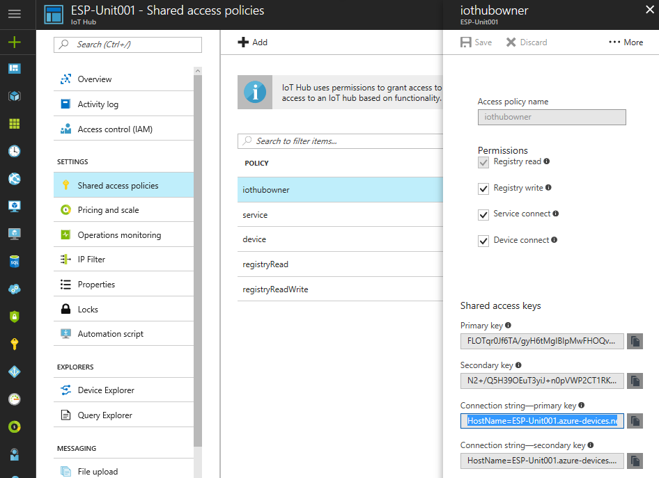
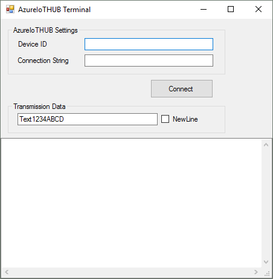
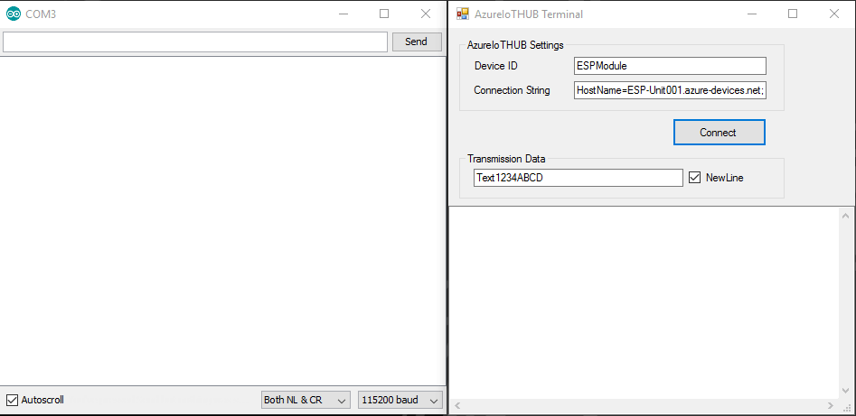

# Azure-IoT-Hub-Simple-Terminal
This is a sample of how to communicate with Azure IoTHub devices.
The projects based on [DeviceExplorer](https://github.com/Azure/azure-iot-sdk-csharp/tree/master/tools/DeviceExplorer) provide Monitor device-to-cloud events and Send cloud-to-device messages.

## How to use
First, you need to setup Azure IoTHub services. [This tutorial](https://docs.microsoft.com/en-us/azure/iot-hub/iot-hub-arduino-huzzah-esp8266-get-started)
 is very helpful how to setup Azure IoTHub, or many instructions about Azure IoTHub on the internet. If you just want to try Auzre IoTHub, you'd better choose Pricing and scale tier: Select the F1 - Free tier.

You need "Connection String"(s) to connect to Azure IoTHub.
See its details from Device Explorer and click on "Shared access policies", "iothubowner" to see the "Connection String"(s) the shown below : 

  

You enter your IoTHub Device ID and the Connection String in Azure-IoT-Hub-Simple-Terminal form, and ready to communicate an Azure IoTHub device then when you click "connect" button.

## Demo
The following demonstration shows using [ESP8266-AzureIoTHub-UART-transparent-bridge](https://github.com/NaoNaoMe/ESP8266-AzureIoTHub-UART-transparent-bridge) and [Azure-IoT-Hub-Simple-Terminal](https://github.com/NaoNaoMe/Azure-IoT-Hub-Simple-Terminal).

  

## Reference Repositories
[DeviceExplorer](https://github.com/Azure/azure-iot-sdk-csharp/tree/master/tools/DeviceExplorer)
